# Class Info
* Time : 2017, 1, 25
* 李宏毅
* Machine Learning 21-1 Recurrent Netral Network(Part I)
# 動機
* Slot Filling
I would like to arrive **Taipei** on **November 2nd**
輸入進入 tick booking system
Destination(Taipei) : Taipei
time of arrival : November 2nd
可以將詞彙透過One-Hot-Encoding, word-Hashing(n-gram), word-embedding
建立文字向量X，透過一個FeedForward Network來預測該文字向量X屬於哪一個slot
Input sequence(文字向量X)
output(屬於Slot的probability distribution)
為一個Multiclass Classification
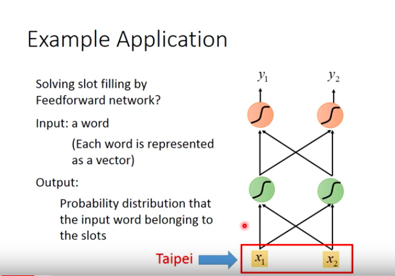</img>
但是這樣會出現一個問題，當我的句子變成leave Taipei on NOvember 2nd，Taipei變成了出發地而不是目的地，但在fcNN中這件事是不會發生的，輸入一樣的詞彙永遠只會有一個y機率最高
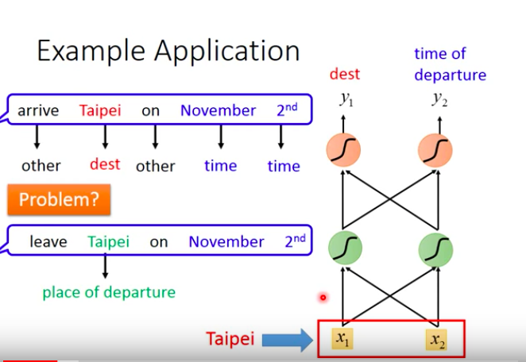</img>

> 我們希望我們的NN是有記憶力的，在case1看過Taipei之前，我們先看過了arrive，在case2看過Taipei之前，我們先看過了leave，NN需要記憶力！

# RNN
* 當hidden layer有output時，就會存到記憶區，左邊的$a_{1}, a_{2}$
* 當hidden layer有input(X)的時候，不只考慮X，還會考慮存在memory裡面的值
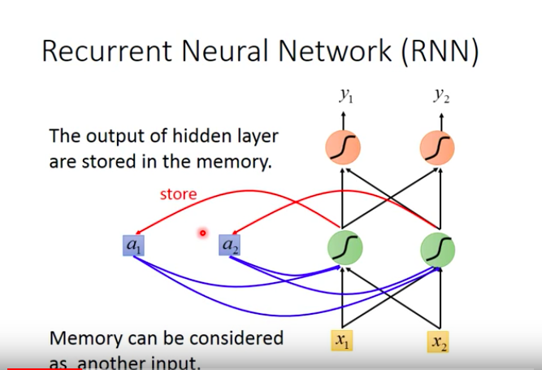</img>
## Example
[Machine Learning Hung-yi Lee NTU 07-01](https://www.youtube.com/watch?v=xCGidAeyS4M&list=PLJV_el3uVTsPy9oCRY30oBPNLCo89yu49&index=30)
### 從例子中得到的一些RNN hints
* 就算Input x都是一樣的，output, y也有可能不同，因為hidden layer計算時還要考慮當前的memory，在不同的時候memory的值可能不一樣
* 承上，input sequence彼此之間並不是獨立的，而是互相依賴的，因此當你的data有順序性，RNN系列就會是你的好幫手

## RNN解決 Slot Filling問題
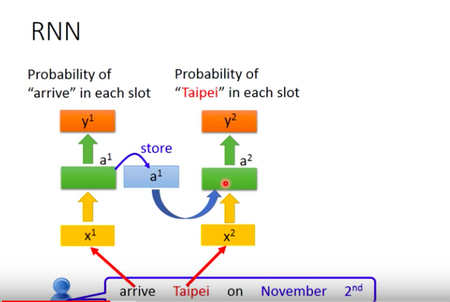</img>
* 這個圖並不是3個NNet，而是同一個NNet在3個時間點被使用了3次，同樣的顏色就是同樣的weight
透過這樣的機制，我們就可以先讀leave，或是arrive，同時存起來，然後在讀取Taipei的時候產生不同的預測y
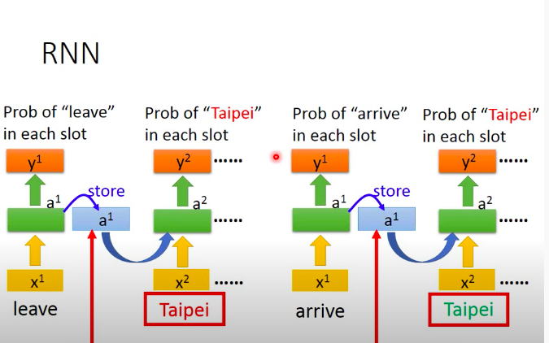</img>
* QA : difference sample of sequence, does memory reset?
## Deep RNN
在剛剛的架構裡面，我們只放了一個RNN hidden layer，我們可以放很多個，每個hidden layer只要output出一個y，就把值存進memory，然後下一回合再拿出來用
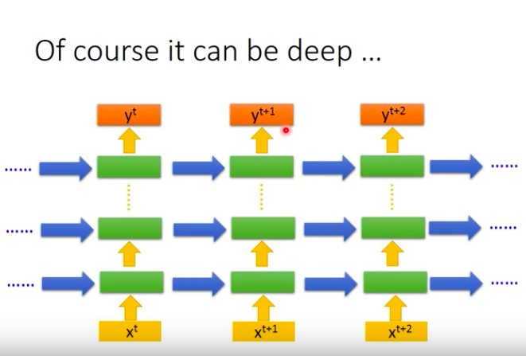</img>

## 不同的RNN
我們剛剛講的，把hidden layer的值存起來，下一回合讀出來這種叫做**Elman Network**
另一種則是Jordan Network，他存的是output的值
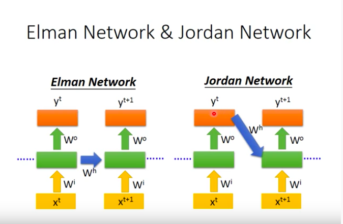</img>
* 傳說中Jordan Network可以有比較好的performance，因為他放進去的事預測的y，比較清楚那個是什麼，有時候我們不太確定NN學到的東西是什麼

## 雙向RNN (Bidirectional RNN)
剛剛談到的都是順著念句子的RNN，我們今天可以把它反接，從後面讀回來，然後把每個hidden layer接起來輸出一個y
* 好處在於雙向的RNN看得比較廣，對於文字的上下文來說有幫助，RNN在預測$y_{t+1}$時不只看了$y_{0}~y_{t}$還看了$y_{t+2}$，但沒辦法用於Time Series
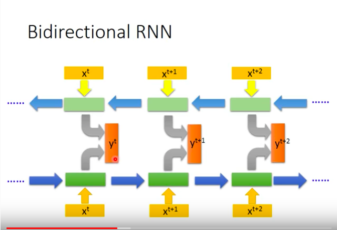</img>

# LSTM
LSTM則是目前最常用的一種RNN架構，以Memory Cell為中心
* Input Gate : 當資料X要寫入時，並須通過一個Input Gate，只有當Input Gate打開的時候，才能把值寫到Memory Cell裡面，關閉時，其他neuron無法寫入，什麼時候開什麼時候關則是讓NN自己學
* Output Gate : 同樣道理，打開時，其他neuron能夠從Memory Cell讀值，關閉時則無法讀值，也是NN自己學
* Forget Gate : Forget Gate會決定什麼時候把Memory Cell的值清空，同樣的，也是NN自己學
所以整個LSTM可以看成4個input，一個output的Special Neuron
1. Input Sequence $X$
2. Sinal control the Input Gate
3. Sinal control the Output Gate
4. Sinal control the Forget Gate
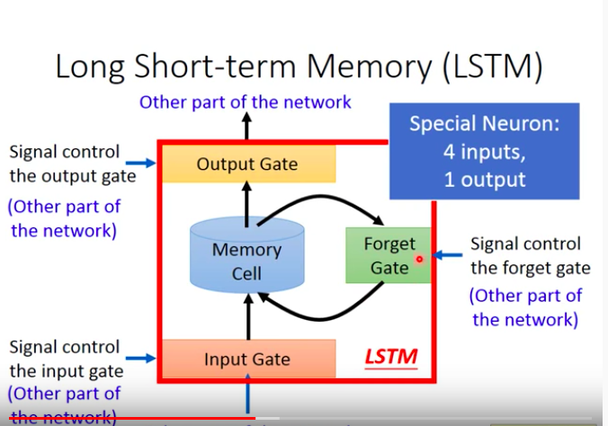</img>
一個冷知識 : Long Short-term，dash應該放在Short-term之間，這樣比較make sense，意思是比較長的Short-term memory
更數學的方式來看，應該會像這個樣子
1. Input $z$ activation func $g$
2. Input Gate Signal $z_{i}$ activation func $f$
3. Forget Gate Signal $z_{f}$ activation func $f$
4. Output Gate Signal $z_{o}$ activation func $f$
* 其中 $f$ 通常為sigmoid function，介在0~1，模擬打開和關閉

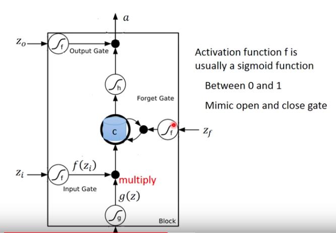</img>
Input值 : $g(z)f(z_{i})$ 
> when $f(z_{i}) -> 0$ 等同於沒有Input值
新的memory值 : $c' = g(z)f(z_{i}) + cf(z_{f})$
> when $f(z_{f}) -> 1$ 等同於**記得**之前的memory
> when $f(z_{f}) -> 0$ 等同於**忘記**之前的memory
> forget gate的開關與我們的直覺想法是相反的

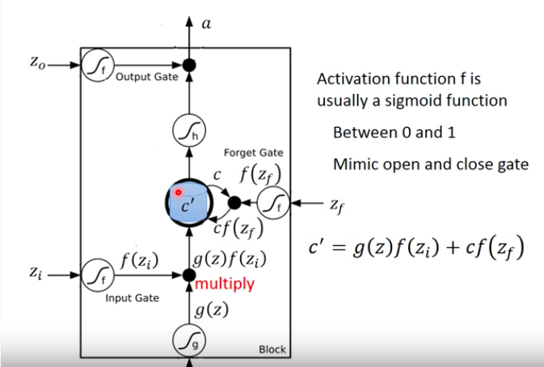</img>
接下來通過activation func $h$，得到$h(c')$
在與output gate的signal內積得到
$a = h(c')f(z_{0})$

> $f(z_{0}) -> 0$ 等同於沒有輸出值
> $f(z_{0}) -> 1$ 等同於全部輸出

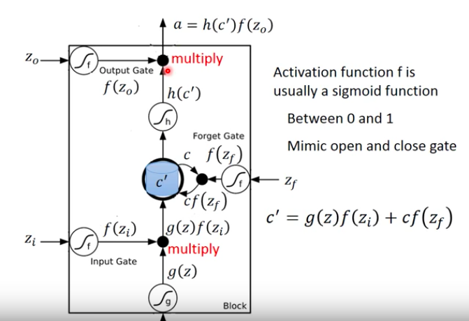</img>

 [影片範例解說-人體LSTM - 28:00~37:00](https://www.youtube.com/watch?v=xCGidAeyS4M&list=PLJV_el3uVTsPy9oCRY30oBPNLCo89yu49&index=30)

 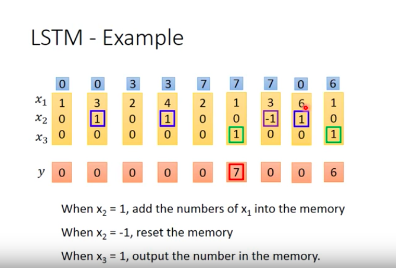</img>

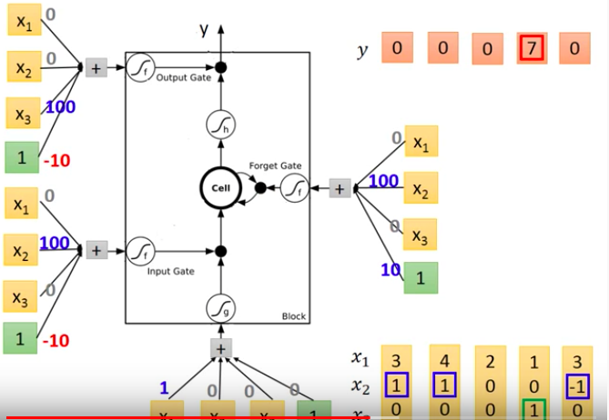</img>

 * Input的X在每個cell加上一個bias，就得到輸入的4個值
 * 每個Gate對於每個Input會乘上一組Weight然後透過sigmoid function變成訊號
 
 ## 怎麼LSTM Cell和我們原本的NN很不像？
 * 原本的NN : 
  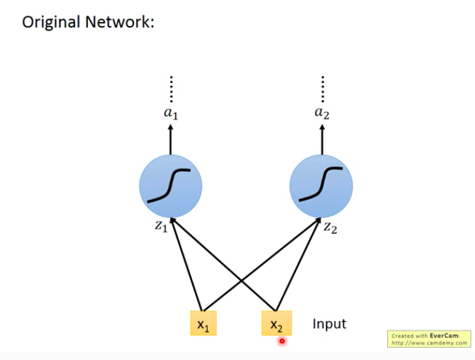</img>
 * LSTM : 原本一個cell只需要一個input，現在則需要4個input(分別是WX+b, input Gate, forget Gate, output Gate)，所以需要的參數量是4倍
  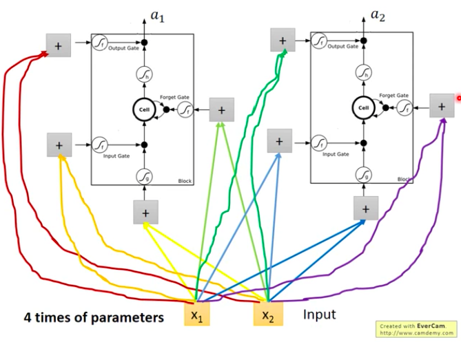</img>
 * 那跟RNN的關係是什麼? 我們針對memory來說明一下
   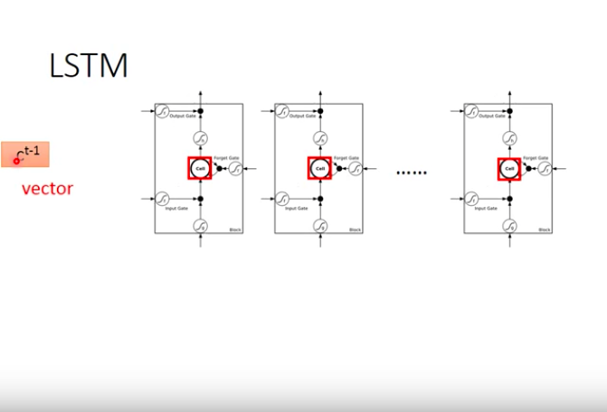</img>
   想像我們現在有一排LSTM Cell，我們把所有memory cell裡面的值接下來，就變成了一個Vector $c^{t-1}$

   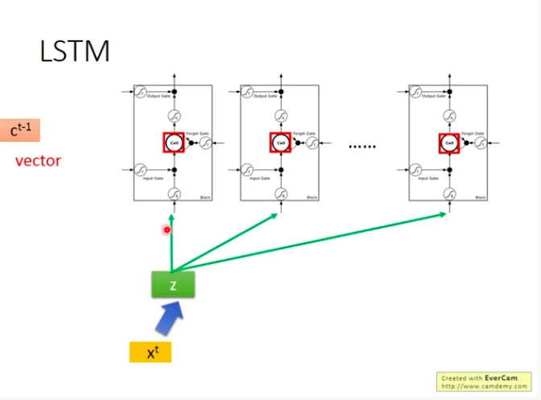</img>
   在時間點$t$，$x^{t} -> z$，z會有$k$個dimension，會恰好對應到k個LSTM Cell，分別為輸入每個LSTM Cell的輸入值。

   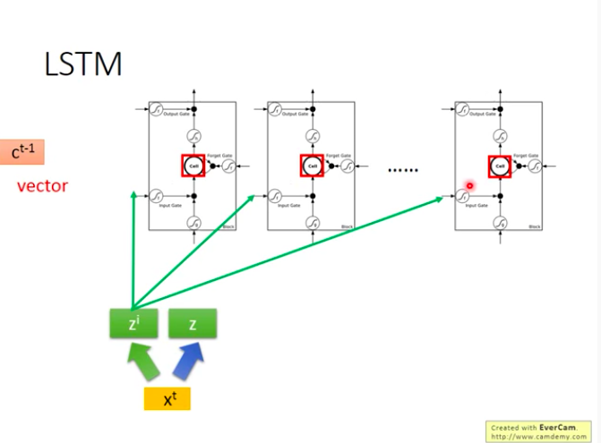</img>
   因此類推，$x^{t} -> z^{i}$，分別為每個LSTM Cell的Input Gate值，經過sigmoid fuction之後會變成每個LSTM Input Gate的輸出值

   forget Gate和Output Gate也是同樣過程，這裡就不再贅述
   
   總結來說，我們把$x^{t}$ linear transform，變出$z^{f}, z^{i}, z, z^{o}$ 4個vectors，4個vector的dimension $k$，且k即為LSTM cell的個數
   
   一個LSTM Cell的工作流程如下圖，注意，這裡的右邊是第$p$個cell，$z$的輸入值是$z$ vector的第p個dimension， $p < k$
   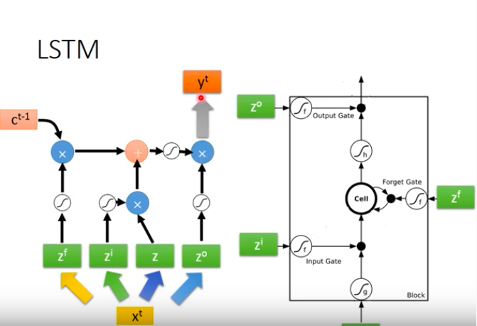</img>
   
   實際上在計算出$c^{t}$時，$c^{t}$和output $h^{t}$會同時被拉近下一次$x^{t+1}$的運算
   實際上keras裡面支援三種，LSTM, GRU, SimpleRNN，都只要一行XD
  
  實際上在做LSTM的時候，不只會輸入x，在sequence中，也會把上個時刻的output $h_{t-1}$, memory $c_{t-1}$也一起和$x_{t}$拼接起來當作input