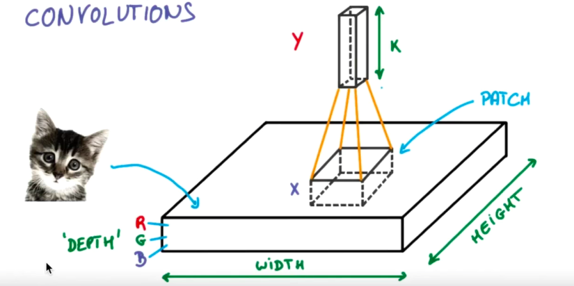
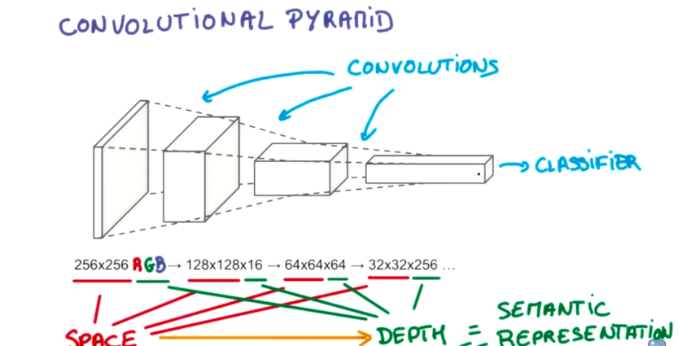
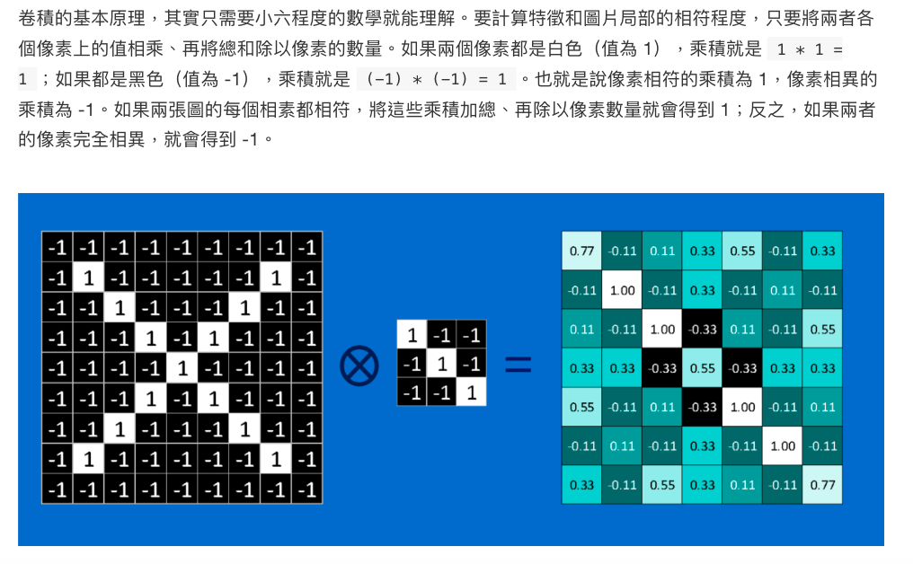
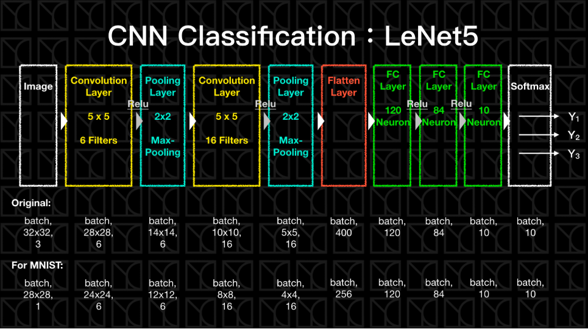

# 影像的特性
1. 局域性 : 通常來說物件只在一個局域當中有效，而與太遠的距離無關([註1]這一點和TimeSeries有著類似的特徵) - 鳥嘴 - 只需看鳥嘴的部分，而不一定需要其他部分，尤其當這樣的特性越強的時候更是如此
2. 平移性 : 通常一張圖任意平移不會影響他的意義，一隻鳥不管放在圖片的左上角還是右下角，他都是一隻鳥(這一點和TimeSeries及Text就不同)
3. 縮放性 : 通常一張圖我把他等比例縮放不影響它的意義
# DNN應用在影像上的侷限
1. 局部性? DNN將所有像素攤平，如此一來就不考慮相鄰關係
2. 平移性? 沒有，沒有局域性就沒有平移性，因為整張圖是一起算的
3. 縮放性? 因為圖面已經被攤平了，也沒辦法做縮放

`也就是說，勢必存在更好描述圖片的方式，如果我們有這個需要`

# CNN拯救世界
* 如果可以在描述原始圖片資料時，把上述3個特性描述出來，那就會是一個更好的描述方式，Convolution Neurel Network有兩大新要素
1. Convolution Layer (描述了局域性及平移性)
2. Pooling Layer (描述了縮放性)

`如果我們要描述的資料有類似的特性，我們就可以加入類似的手法為Ｍodel添加這樣的描述性`

## Convolution Layer
設計一個filter matrix，我們透過一個局部的像素點，輸入下一層神經元
逐步的萃取圖片鄰近的資訊

</img>
</img>
[TODO] 數學式解釋
* 概念解釋
如果我們的filter matrix是一個鳥嘴的小圖，一但遇到與鳥嘴相似的局部時，此時加總就會是一個大的值，如果是一個和鳥嘴無關的局部時，加總會是一個小的值
如此一來，這個filter matrix就具有將特定特徵篩選出來的能力，符合程度高則特徵分數高，反之亦然，如此一來我們的Model就能夠具有局部性，而藉由filter matrix的平移掃視，這格特徵就具有可平移的特性。
[動畫圖 at 06:20](https://morvanzhou.github.io/tutorials/machine-learning/tensorflow/5-03-CNN1/)
實際情況下，filter matrix的weight是會自行調整的，因此在Fitting時，Model會根據數據自行訓練出filter matrix，也就是說機器可以自行學習圖片的特徵，通常這樣的filter matrix會有好幾個，讓Model可以有更多維度可以學習
## Pooling Layer

以Pixel的觀點來看，最簡單的放大方法是，在每個原有的Pixels附近增加一些與他們相似的Pixel，這樣就能夠直接把小圖變成大圖(雖然畫質很差XD)，不過這是最簡單的放大方法，那麼縮小就相反操作，把一群附近的Pixels濃縮成一個Pixel當作代表，就可以達到縮小圖片的效果
所以回到Pooling Layer，Pooling所做的就是縮小圖片，假設今天使用2 * 2 Pooling，則會在原圖上做 2 * 2 掃描，因此有4個元素被檢視，然後產生一個代表值，把原本2 * 2 -> 1 * 1，所以，如果是Max Pooling 擇取max, Average Pooling -> 平均值

# 實作
## Convolutional Layer
[TODO] 從一個簡單的例子了解Convolutional Layer如何運作
```
import random
import numpy as np
import tensorflow as tf
import matplotlib.pyplot as plt

tf.logging.set_verbosity(tf.logging.ERROR)

# Config the matplotlib backend as plotting inline in IPython
%matplotlib inline
```
```
with tf.Session() as sess:
    img = tf.constant([[[1], [2], [0], [0], [0]]
                       [[3], [0], [0], [1], [2]],
                       [[0], [0], [0], [3], [0]],
                       [[1], [0], [0], [1], [0]],
                       [[0], [0], [0], [0], [0]]]], tf.float32)
    # shape [batch, in_height, in_wider, in_channels]

    
    filter_ = tf.constant([[[[1]], [[2]]],
                                 [[[3]], [[0]]]], tf.float32)
    # shape of filter: [filter_x, filter_y, in_channels, out_channels]

    conv_stride = (1,1)
    padding_method = 'VALID'
    conv = tf.nn.conv2d(
        img,
        filter_,
        strides=[1, conv_strides[0], conv_strides[1], 1]
        padding=padding_method
    )
```
### img
* batch 每次要處理幾張圖
* in_height 長(高)
* in_width  寬
* in_channels 通常會是RBG表示顏色，只有一個維度則表示灰階
### filer_
* filter_height 高(長)
* filter_width  寬
* in_channels 輸入圖片的in_channels
* out_channels 輸出的Convolutional pymid 厚度 
### strides
con_strides[0] 在圖片上平移每步的距離
con_strides[1] 在圖片上平移每步的距離
第1個維度則是表示batch (通常是不動的)
第4個維度則是表示in_channels (通常是不動的)
padding : 指的是掃描圖片的方式，分成VALID和SAME兩種
VALID
不額外補上0在邊界
SAME
額外補上0的邊界，使得輸出的維度與輸入一樣

## Pooling Layer
```
with tf.Session() as sess:
    img =tf.constant([[[[1], [2], [0], [0]],
                       [[3], [0], [0], [1]],
                       [[0], [0], [0], [3]],
                       [[1], [0], [0], [1]]]], tf.float32)
    # shape of img: [batch, in_height, in_width, in_channels]

    pooling = tf.nn.max_pool(img, ksize=[1, 2, 2, 1], strides=[1, 2, 2, 1], padding='VALID')
    print('Shape of pooling:')
    print(pooling.eval().shape)
    print('Pooling:')
    print(pooling.eval())
```
### k_size 
* kernel size，也就是要進行 Pooling的大小
```
Shape of pooling:
(1, 2, 2, 1)
Pooling:
[[[[3.]
   [1.]]

  [[1.]
   [3.]]]]
```
# Hint
1. 註1 : CNN也常常拿來用在TimeSeries領域以及TextMiming領域，了解CNN為何那麼適合圖像的原因有助於我們跳躍思考將CNN應用在其他領域。
   1. 所謂與TimeSeries有著類似的特徵 : 通常要預測的目標與**較近時間點發生的事情較有關係(lag feature)**，與較遠時間點發生的事情關係可能較小。
   2. 用在文字中則是表述上下文關係，近的部分能夠互相解釋，較遠的部分則未必。
2. 了解CNN設計所為了解決的問題，有助於我們對於未知資料的思考方式，例如AutoEncoder透過將原始資料加一點高斯噪聲，再將output設為自己，就能夠訓練出更Robust的神經元(可以想像為特徵)，這樣的手法可以用在任何的Modeling上
3. Convolution的一個簡單例子
</img>

[Reference Here](https://brohrer.mcknote.com/zh-Hant/how_machine_learning_works/how_convolutional_neural_networks_work.html)

Convolution可視為是一種矩陣的局部相似度運算(對比於向量的內積)，
透過一個大矩陣$A$，小矩陣$B$能夠定義Convolution
$$C = A \bigotimes B$$ 其中矩陣$C$，描述了$A$的局部與$B$相似的程度
Convolution在圖像，訊號，領域有著非常多的應用，像是圖像局部相似(CNN)，固態物理(波動解析)...等

[Another Reference](https://www.zhihu.com/question/39022858)

## LeNet5
</img>
* Hint 使用Convolution Layer抓取圖片特徵，使用Relu，他的好處是不會出現梯度消失(Vanishing Gradient)，使用tanh, sigmoid,在飽和區梯度會接近0的函數，很有可能在深網路的情況下，造成一開始的幾個Layer梯度太小的問題，Relu在Turn-on時是線性的，不會有飽和的問題，也不會有所謂梯度消失
