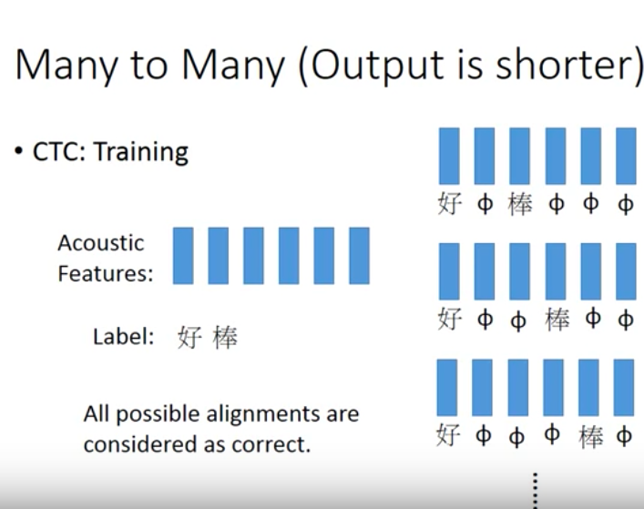

# Class Info
* Time : 2017, 1, 25
* 李宏毅
* Machine Learning 21-1 Recurrent Netral Network(Part II)
### 摘要
* LSTM, RNN 使用的損失函數處理方式是BP的變形BPTT(Backpropagation through time) 
* LSTM最早在97年被提出，當初是為了解決Gradient Vanisihing的問題，所以當初是沒有forget gate的，forgate是後來才加上去的
* Gate Recurrent Unit(GRU) 只有兩個Gate，training比較robust，如果你的LSTM，overfitting的比較嚴重，可以考慮GRU
* 還有很多處理Gradient Vanish問題的方法，例如Clockwise RNN, SCRN(Strucurally Constrained RN)
### More Applications
* 在Slot Filling的部分
* Input and output are both sequences with the same length(每個word都給一個slot的機率分佈)
#### Many to one
* vector sequence -> one vector
(Sentiment Analysis)
Input : char sequence 
Output Multiple classification(超好雷，好雷，普雷，負雷，超負雷)

(Key Term Extraction)
Input : char sequence

#### Many to Many
* vector sequence -> vector sequence (but output is shorter)
* Input 聲音訊號 (vector sequence)
* Output 好棒 (character sequence) 
CTC : 不只輸出符號，還輸出null，然後最後把null拿掉
</img>
* 傳說中Google Tranlate已經全部用CTC了

#### Many to Many (No Limitation)
* Sequence to sequence learning(翻譯)
* 一堆英文句子對應中文句子(也是行得通的)

* Syntactic parsing (看句子得到文法樹狀結構)
* Sequence to sequence autoencoder
(把docuemtation變成vector而且考慮了order)
Unsupervised

* Sequence to sequence learning Chat-bot 
  
#### Attention-bassed Model