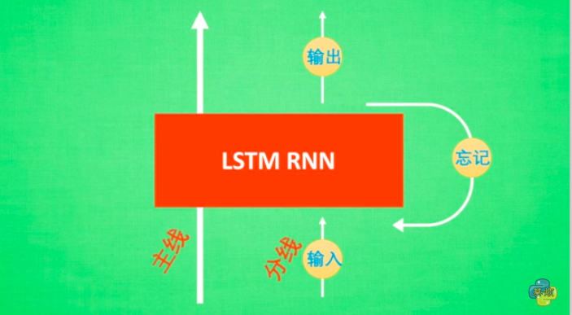

# 概述RNN
當我們的問題具有時序性，我們的NN就必須具有記憶的功能，**在不斷輸入新資訊的同時，也能保有歷史資訊的影響**，最簡單的方法，就是將Output保留，等到新資訊進來時，將新的資訊以及舊的Output一起考量來訓練NN。
[影片解說 1:32~](https://morvanzhou.github.io/tutorials/machine-learning/tensorflow/5-07-A-RNN/)

# Unrolling
這種將就舊有資訊保留的NN統稱為RNN(Recurrent Neural Network)，這種不斷回饋的網路可以攤開來處理，假如我有5筆數據，拿來訓練一個RNN，5個回合，並且更新了5次，其實等效於攤開來一次處理5筆資料，然後做一次更新，這種手法稱為Unrolling，我們實作上會使用Unrolling手法來增加計算效率

# 時序性的秘密
下圖為最簡單的RNN型式，我們將上一回產生的Output和這一回合產生的input一起評估出這一回合的Output
$$o_{new} = tanh(iW_i + oW_o + B)$$

如此一來RNN就具有時序性了，舊的歷史資料可以被記憶下來，你可以把RNN的記憶看成一種**短期記憶**，因為它實際上只記得上一回合的Output而已[註]

# 梯度消失與梯度爆炸
梯度消失(Gradient Vanishing)，梯度爆炸(Gradient Exploding)
但這種形式上的RNN會遇到很大的問題，tanh這種具有飽和區的activation function，會造成梯度消失的問題，而且如果我們使用Unrolling的觀點來看RNN，會發現這是一個超級深的網路，Backpropagation必須一路回到$t_{0}$的RNN，想當然，有些梯度將會消失，部分權重會更新不到，那是否可以使用`Relu`呢?
不過這個網路除了有梯度消失，還有另一個問題，梯度爆炸

## 梯度爆炸? - 更大的問題?
雖然我們使用Unrolling的觀點，把網路看成是一個Deep Network網路的連接，但是和之前DNN不同的地方在於，**這些RNN彼此之間是共享同一組權重的**
在RNN的結構裡，一個權重會隨著時間不段的加強影響單一特徵(記得上面那條數學式嗎? RNN Cell之間彼此是串連的)，由於在不同時間之下的RNN Cell共用同一個權重，在權重大於1的情況下，影響將會隨著時間放大到梯度爆炸，權重小於1，影響將會隨著時間縮小到梯度消失，就像蝴蝶效應一般，微小的差異因為回饋的機制，不合理的放大或是消失
因此RNN的Error Surface將會崎嶇不平，這將會造成我們無法穩定找到最佳解，難以收斂，這才是RNN難以使用的重要原因，把Activation Function換成Relu不會解決問題
文獻上告訴我們反而更差

## 很廢的解方 - Gradient Clipping
解決梯度爆炸有一個聽起來很廢但是廣為人知的方法，**Gradient Clipping**，也就是只要在更新過程中梯度超過一個值，我們就切掉讓梯度維持在這個上限，這樣就不會爆炸啦
待會講到的LSTM只能夠解決梯度消失問題，但不能解決梯度爆炸問題，因此我們還是需要Gradient Clipping的幫忙，在Tensorflow中我們怎麼做到Gradient Clipping呢?
以往我們使用`optimizer.minimize(loss)`來進行更新，實際上我們可以把這個步驟拆成兩個部分，第一部分計算所有參數的梯度，第二部分使用這些梯度進行更新
我們可以從中作梗，把gradient偷天換日一番，一開始使用`optimizer.compute_gradient(loss)`來計算個別的梯度，然後使用`tf.clip_by_global_norm(gradient, clip_norm)`來切梯度，最後再使用`optimizer.apply_gradients`用新的梯度進行更新

# LSTM (Long Short term memory network)
[自己的反思]RNN在數學上遇到了難以解決的梯度爆炸與梯度消失問題，這個現象與他使用了上一個Cell的output，並且所有的cell訓練都共享同個權重有關，但RNN這樣的設計基本上意思就是說 : 
* 在時序的觀點上，$t_{0}$, $t_{1}$, $t_{2}$對於當前$t_{k}$的影響是滾雪球式的，但會產生兩個極端，這也是混沌力學的概念，但並沒有廣泛的適用性，因此針對時序機制有一個更普遍性的設計，就會是突破關鍵，所以我們來到了LSTM

LSTM比起了RNN，特別設計了一個`忘記`的機制，以及`長期記憶，短期記憶`的機制，這裡先用白話文來理解一次，再配上比較正規的圖重新理解，這樣會是一個比較快的方式

* 每個Cell則是支線劇情的概念，我們可以透過`忘記`的這個機制，來去決定目前這段支線劇情對主線劇情有多大的重要性
* 長期記憶就像是主線劇情的概念，每次在處理主線劇情時，都是以已經累積的主線劇情，加上當前的支線，以及當前支線對主線的重要程度(由`忘記`來進行控制)

所以以input來說，Input會合上一回合的Output一起評估一個"短期記憶"

$$f_m = tanh(iW_{mi} + oW_{mo} + B_m)$$

接下來，不同於RNN直接輸出，LSTM做了一個類似轉換成"長期記憶"的機制，"長期記憶"在這裡稱為State，State的狀態由三道門進行控制
* Input Gate : 控管哪些"短期記憶"可以進到"長期記憶"
* Forget Gate : 負責調配哪一些"長期記憶"需要被遺忘
* Output Gate : 要從"長期記憶"輸出怎樣的內容
$$f_{state, new} = G_i f_m + G_f f_{state}$$
$$o_{new} = G_o tanh(f_{state, new})$$
State $f_{state}$, Input Gate $G_{i}$, Forget Gate $G_{f}$, Output Gate $G_{o}$
如果我們希望上面Gate的部分具有開關的功能的話，我們會希望Gates可以是0到1的值，0表示全關，1表示全開，$sigmoid$正可以幫我們做到這件事，哪些因素會決定Gates的關閉與否呢?
> 所有輸入這個Cell的資訊，除了上一回合的State，因為上一個回合的State來決定下一個State的操作是不合理的，因此我們就可以寫下所有Gate的表達式了
> 
$$G_i = Sigmoid(iW_{ii} + oW_{io} + B_{i})$$
$$G_f = Sigmoid(iW_{fi} + oW_{fo} + B_{f})$$
$$G_o = Sigmoid(iW_{oi} + oW_{oo} + B_{o})$$
這就是LSTM，`長期記憶`的出現可以解決梯度消失的問題，RNN只有短期記憶，所以一但認為一個特徵不重要，經過幾回的連乘，這個特徵的梯度就會消失殆盡，但LSTM保留State，並且用"加"的方式更新State，所以有一些重要的State得以留下來持續影響Output，解決了梯度消失的問題，但是，不幸的是LSTM還是免不了梯度爆炸，為什麼呢?
如果一個特徵真的很重要，State會記住，Input也會強調，所以幾輪下來還是會出現爆炸的情況，這時候我們就需要Gradient Clipping的幫忙

TODO 實作, maybe needed 
[RNN and LSTM (By Lee)](https://www.youtube.com/watch?v=xCGidAeyS4M&list=PLJV_el3uVTsPy9oCRY30oBPNLCo89yu49&index=30)

# Math

* 另一種常見表示法(注意，這只是示意圖，Unfold, fold模式其實並不存在)

# Remark
[註] [還需要讀原始論文確認] RNN被大眾說是"短期記憶"模型，是論文原文這樣說的嗎? 根據RNN的問題，同時存在梯度消失與梯度爆炸，雖然數學式在單個Cell中只和上個Cell的output有關，但前兩個Cell的結果不會傳遞到當前Cell的這個說法並不是正確的 : 
TODO [李鴻毅 數學式Part]
$$o_{t2} = tanh(iW_{t1} + oW_{t1} + B_{t1})$$
我們可以知道，在上一個cell $t_{1}$實際上和cell $t_{0}$有關:
$$o_{t1} = tanh(iW_{t0} + oW_{t0} + B_{t0})$$
我們可以將兩式Combine
$$o_{t2} = tanh(iW_{t1} + oW_{t1} + B_{t1})$$